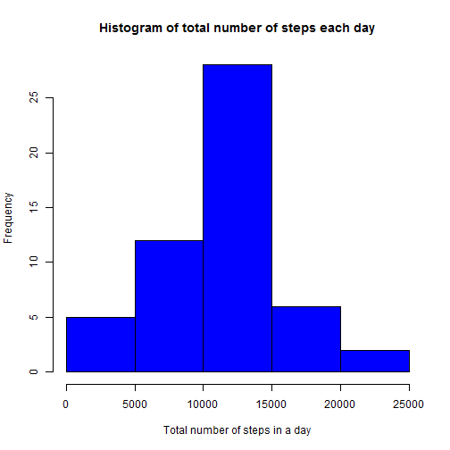
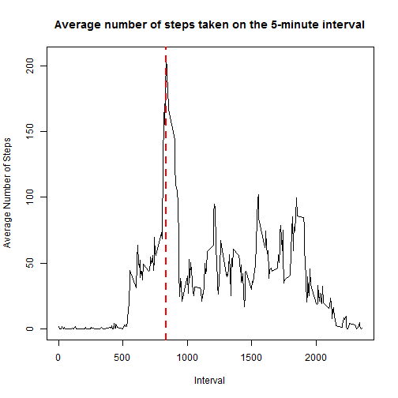
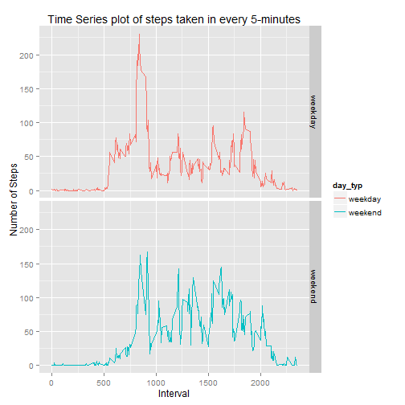

Reproducible Research: Peer Assessment 1
=========================================


## Loading and preprocessing the data


```r
    acts <- read.csv("activity.csv", header = T)
    at <- acts[which(complete.cases(acts)),]
```


## What is mean total number of steps taken per day?

1. Make a histogram of the total number of steps taken each day.


```r
    totl_stps_day <- aggregate(steps ~ date, data=at, sum, na.rm=T)
    hist(totl_stps_day$steps, col=4, xlab="Total number of steps in a day", main="Histogram of total number of steps each day")
```

 

2. Calculate and report the mean and median total number of steps taken per day.


```r
    men <- mean(totl_stps_day$steps, na.rm=T)
    men
```

```
## [1] 10766.19
```

```r
    mdn <- median(totl_stps_day$steps, na.rm=T)
    mdn
```

```
## [1] 10765
```

- The mean of total number of steps taken per day is 1.0766189 &times; 10<sup>4</sup>.
- The median of total number of steps taken per day is 10765.


## What is the average daily activity pattern?

1. Make a time series plot (i.e. type = "l") of the 5-minute interval (x-axis) and the average number of steps taken, averaged across all days (y-axis).


```r
    avg_stps_interval <- aggregate(steps ~ interval, data=at, mean, na.rm=T)

    mx <- avg_stps_interval[which(avg_stps_interval$steps == max(avg_stps_interval$steps)),]

    plot(x=avg_stps_interval$interval, y=avg_stps_interval$steps, type="l", xlab="Interval", ylab="Average Number of Steps", main="Average number of steps taken on the 5-minute interval")

    abline(v=mx$interval, col="red", lwd=2, lty=2)
```

 


2. Which 5-minute interval, on average across all the days in the dataset, contains the maximum number of steps?

    The interval **835** contains the maximum number of steps and is **206.1698113**.


## Imputing missing values

1. Calculate and report the total number of missing values in the dataset (i.e. the total number of rows with NAs)


```r
    ttl_NA <- nrow(acts)-nrow(at)
```

    The total number of missiong values are **2304**.


2. Devise a strategy for filling in all of the missing values in the dataset. The strategy does not need to be sophisticated. For example, you could use the mean/median for that day, or the mean for that 5-minute interval, etc.

    The devise is that check for the steps value for every row in original dataset and if found replace it with the mean / average value that was calculated in Second assignment and stored in the object *avg_stps_interval* in this solution.

3. Create a new dataset that is equal to the original dataset but with the missing data filled in.


```r
    new_dataset <- acts
    
    for(i in 1:nrow(new_dataset)){
        if(is.na(new_dataset[i,1])){
            new_dataset[i,1] <- avg_stps_interval[which(avg_stps_interval$interval==new_dataset[i,3]),]$steps
        }
    }

    head(new_dataset,10)
```

```
##        steps       date interval
## 1  1.7169811 2012-10-01        0
## 2  0.3396226 2012-10-01        5
## 3  0.1320755 2012-10-01       10
## 4  0.1509434 2012-10-01       15
## 5  0.0754717 2012-10-01       20
## 6  2.0943396 2012-10-01       25
## 7  0.5283019 2012-10-01       30
## 8  0.8679245 2012-10-01       35
## 9  0.0000000 2012-10-01       40
## 10 1.4716981 2012-10-01       45
```


4. Make a histogram of the total number of steps taken each day and Calculate and report the mean and median total number of steps taken per day. Do these values differ from the estimates from the fist part of the assignment? What is the impact of imputing missing data on the estimates of the total daily number of steps?


```r
    new_ttl_stps_day <- aggregate(steps ~ date, data=new_dataset, sum, na.rm=T)

    hist(new_ttl_stps_day$steps, col=6, xlab="Total number of steps in a day", main="Histogram of total number of steps each day after Imputing")
```

 

```r
    nw_men <- mean(new_ttl_stps_day$steps, na.rm=T)
    nw_men
```

```
## [1] 10766.19
```

```r
    nw_mdn <- median(new_ttl_stps_day$steps, na.rm=T)
    nw_mdn
```

```
## [1] 10766.19
```
    
- The mean and median of new dataset are **1.0766189 &times; 10<sup>4</sup>** and **1.0766189 &times; 10<sup>4</sup>** respectively.
- The difference between new and previous mean is **0**.
- The difference between new and old median is **1.1886792**.
    
**There is no any changes in mean but the median is slightly increased.**


## Are there differences in activity patterns between weekdays and weekends?

1. Create a new factor variable in the dataset with two levels - "weekday" and "weekend" indicating whether a given date is a weekday or weekend day.


```r
    new_dataset$day_typ <- "weekday"
    new_dataset$date <- as.Date(new_dataset$date,"%Y-%m-%d")
    new_dataset[weekdays(new_dataset$date)=="Saturday" | weekdays(new_dataset$date)=="Sunday",]$day_typ <- "weekend"
    
    tail(new_dataset,10)
```

```
##           steps       date interval day_typ
## 17559 0.0000000 2012-11-30     2310 weekday
## 17560 0.8301887 2012-11-30     2315 weekday
## 17561 0.9622642 2012-11-30     2320 weekday
## 17562 1.5849057 2012-11-30     2325 weekday
## 17563 2.6037736 2012-11-30     2330 weekday
## 17564 4.6981132 2012-11-30     2335 weekday
## 17565 3.3018868 2012-11-30     2340 weekday
## 17566 0.6415094 2012-11-30     2345 weekday
## 17567 0.2264151 2012-11-30     2350 weekday
## 17568 1.0754717 2012-11-30     2355 weekday
```


2. Make a panel plot containing a time series plot (i.e. type = "l") of the 5-minute interval (x-axis) and the average number of steps taken, averaged across all weekday days or weekend days (y-axis). The plot should look something like the following, which was creating using simulated data:


```r
    avg_stps_intvl_dy <- aggregate(steps ~ interval + day_typ, data=new_dataset, mean, na.rm=T)
    library(ggplot2)
    qplot(x=interval,y=steps, data=avg_stps_intvl_dy, geom="line", type="l", facets=day_typ~., col=day_typ, xlab="Interval", ylab="Number of Steps", main="Time Series plot of steps taken in every 5-minutes")
```

 
